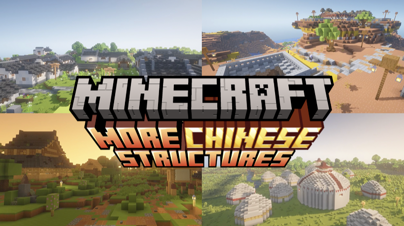

# MoreChineseStructures pack

MoreChineseStructures is a Minecraft datapack that enriches your gameplay experience by introducing a variety of traditional Chinese structures complete with unique gameplay elements to the world of Minecraft.

## Structures
### 4 New Villages
- Hui-Style Chinese Villages
- Yaodong Villages, a particular form of earth shelter dwelling common in the Loess Plateau in China's north.
- Ganlan Villages of the south
- Yurt Villages from Mongolia

### 4 Big structures to explore and conquer
- The tower
- The castle
- The skypalace
- Budda statues inspired by the Leshan Giant Buddha

### Other things
- various different little temples scattered around the world

## Biomes
- Megaplains, where the yurts will be located

